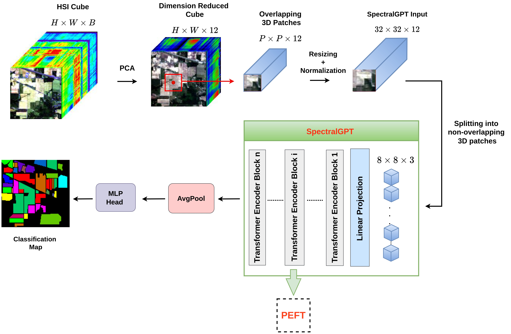
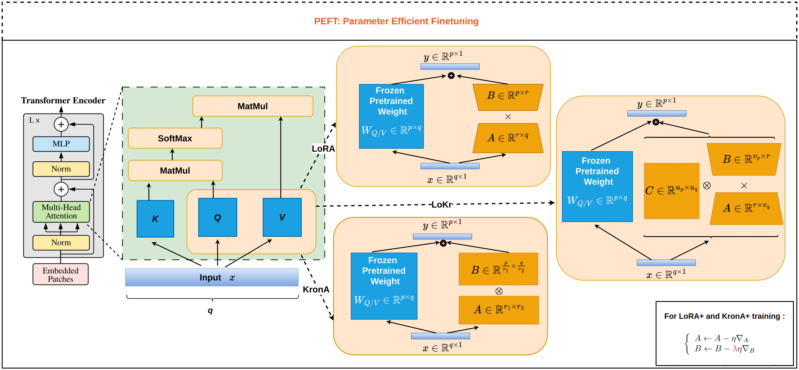

# PEFT_HSIC : Parameter-Efficient Fine-Tuning of Multispectral Foundation Models for Hyperspectral Image Classification
This the official code for  "Parameter-Efficient Fine-Tuning of Multispectral Foundation Models for
Hyperspectral Image Classification". 

Authors: Bernardin Ligan, Khalide Jbilou, Fahd Kalloubi, Ahmed Ratnani

Arxiv : https://arxiv.org/abs/2505.15334

Paper Website: 

### An overview of the overall pipeline used to fine-tune the SpectralGPT model for hyperspectral image classification.

### The Parameter-Efficient Fine-Tuning (PEFT) strategies used in the study

# Dependencies
